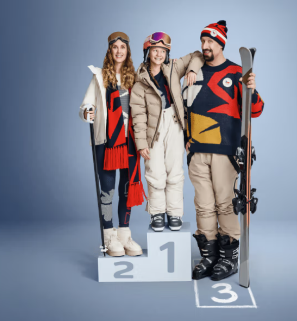

# Innogy Puck Catcher Game - Rebuild Instructions

## Overview

Rebuild the innogy promotional puck-catching game with cleaner architecture, better separation of concerns, and improved maintainability.

---

## Project Structure

```
gamifikace/
├── index.html          # Minimal HTML shell
├── css/
│   └── styles.css      # All styles extracted
├── js/
│   ├── main.js         # Entry point, initialization
│   ├── game/
│   │   ├── Game.js     # Main game controller class
│   │   ├── State.js    # Game state management
│   │   ├── Physics.js  # Collision detection, movement
│   │   └── Renderer.js # All canvas drawing logic
│   ├── entities/
│   │   ├── Goal.js     # Goal/net entity
│   │   ├── Puck.js     # Falling puck entity
│   │   └── Confetti.js # Particle effects
│   ├── ui/
│   │   ├── HUD.js      # In-game overlay
│   │   ├── Leaderboard.js # Score storage & display
│   │   └── Overlays.js # Start/end screens
│   └── utils/
│       ├── constants.js # All magic numbers
│       ├── helpers.js   # Utility functions
│       └── input.js     # Input handling
└── assets/
    ├── innogy-bg.png
    ├── innogy-logo.svg
    └── innogy-logo.png
```

---

## Step 1: Constants & Configuration

Create `js/utils/constants.js`:

```javascript
export const CANVAS = {
  WIDTH: 900,
  HEIGHT: 520
};

export const COLORS = {
  BRAND_PRIMARY: '#e5007d',
  BRAND_SECONDARY: '#7a2cff',
  TEXT: '#ffffff',
  MUTED: '#d7d3ee'
};

export const GAME = {
  INITIAL_LIVES: 3,
  INITIAL_SPAWN_INTERVAL: 44,  // frames between spawns
  INITIAL_SPEED: 2.25,
  DIFFICULTY_RAMP_INTERVAL: 540, // frames (9 seconds at 60fps)
  SPAWN_INTERVAL_DECREASE: 2,
  SPEED_INCREASE: 0.28,
  MIN_SPAWN_INTERVAL: 24,
  MAX_SPEED: 7.0
};

export const GOAL = {
  WIDTH: 170,
  HEIGHT: 52,
  FRAME_WIDTH: 10,
  Y_OFFSET: 74  // from bottom
};

export const PUCK = {
  MIN_RADIUS: 18,
  MAX_RADIUS: 28,
  SPEED_VARIANCE: 1.15,
  SPAWN_MARGIN: 60
};

export const EFFECTS = {
  CONFETTI_COUNT: 18,
  CONFETTI_COUNT_GOLD: 44,
  NET_WAVE_DURATION: 26,
  NET_WAVE_AMPLITUDE: 9,
  CATCH_FLASH_DECAY: 0.09
};

export const STORAGE_KEY = 'innogy_puck_game_v1';
```

---

## Step 2: Utility Functions

Create `js/utils/helpers.js`:

```javascript
/**
 * Escape HTML to prevent XSS
 */
export function escapeHtml(str) {
  const entities = {
    '&': '&amp;',
    '<': '&lt;',
    '>': '&gt;',
    '"': '&quot;',
    "'": '&#39;'
  };
  return str.replace(/[&<>"']/g, char => entities[char]);
}

/**
 * Format timestamp for display
 */
export function formatDate(timestamp) {
  return new Date(timestamp).toLocaleString('cs-CZ', {
    month: 'short',
    day: '2-digit',
    hour: '2-digit',
    minute: '2-digit'
  });
}

/**
 * Clamp value between min and max
 */
export function clamp(value, min, max) {
  return Math.max(min, Math.min(max, value));
}

/**
 * Linear interpolation
 */
export function lerp(start, end, factor) {
  return start + (end - start) * factor;
}

/**
 * Draw rounded rectangle path
 */
export function roundedRectPath(ctx, x, y, width, height, radius) {
  const r = Math.min(radius, width / 2, height / 2);
  ctx.beginPath();
  ctx.moveTo(x + r, y);
  ctx.arcTo(x + width, y, x + width, y + height, r);
  ctx.arcTo(x + width, y + height, x, y + height, r);
  ctx.arcTo(x, y + height, x, y, r);
  ctx.arcTo(x, y, x + width, y, r);
  ctx.closePath();
}
```

---

## Step 3: Input Handler

Create `js/utils/input.js`:

```javascript
export class InputHandler {
  constructor(canvas) {
    this.canvas = canvas;
    this.targetX = canvas.width / 2;
    this.keys = { left: false, right: false };

    this.bindEvents();
  }

  bindEvents() {
    // Mouse
    this.canvas.addEventListener('mousemove', (e) => {
      this.targetX = this.getCanvasX(e.clientX);
    });

    // Touch
    this.canvas.addEventListener('touchmove', (e) => {
      e.preventDefault();
      this.targetX = this.getCanvasX(e.touches[0].clientX);
    }, { passive: false });

    // Keyboard
    window.addEventListener('keydown', (e) => {
      if (e.key === 'ArrowLeft') this.keys.left = true;
      if (e.key === 'ArrowRight') this.keys.right = true;
    });

    window.addEventListener('keyup', (e) => {
      if (e.key === 'ArrowLeft') this.keys.left = false;
      if (e.key === 'ArrowRight') this.keys.right = false;
    });
  }

  getCanvasX(clientX) {
    const rect = this.canvas.getBoundingClientRect();
    return (clientX - rect.left) * (this.canvas.width / rect.width);
  }

  update(currentX, speed = 10) {
    if (this.keys.left) this.targetX -= speed;
    if (this.keys.right) this.targetX += speed;
    return this.targetX;
  }
}
```

---

## Step 4: Entity Classes

### Create `js/entities/Puck.js`:

```javascript
import { PUCK, CANVAS } from '../utils/constants.js';

export class Puck {
  constructor(speedBase) {
    this.radius = PUCK.MIN_RADIUS + Math.random() * (PUCK.MAX_RADIUS - PUCK.MIN_RADIUS);
    this.x = PUCK.SPAWN_MARGIN + Math.random() * (CANVAS.WIDTH - PUCK.SPAWN_MARGIN * 2);
    this.y = -30;
    this.prevY = this.y;
    this.vy = speedBase + Math.random() * PUCK.SPEED_VARIANCE;
    this.caught = false;
    this.squash = 0;
    this.markedForRemoval = false;
  }

  update() {
    this.prevY = this.y;
    this.y += this.vy;
  }

  isOffScreen() {
    return this.y > CANVAS.HEIGHT + 40;
  }
}
```

### Create `js/entities/Goal.js`:

```javascript
import { GOAL, CANVAS } from '../utils/constants.js';
import { clamp, lerp } from '../utils/helpers.js';

export class Goal {
  constructor() {
    this.width = GOAL.WIDTH;
    this.height = GOAL.HEIGHT;
    this.x = CANVAS.WIDTH / 2;
    this.y = CANVAS.HEIGHT - GOAL.Y_OFFSET;

    // Net wave effect
    this.wave = {
      ttl: 0,
      amplitude: 0,
      phase: 0,
      impactX: this.x
    };
  }

  update(targetX) {
    // Smooth movement with easing
    const margin = 70;
    const clampedTarget = clamp(targetX, margin, CANVAS.WIDTH - margin);
    this.x = lerp(this.x, clampedTarget, 0.22);

    // Update wave effect
    if (this.wave.ttl > 0) {
      this.wave.ttl--;
      this.wave.phase += 0.65;
    }
  }

  triggerWave(impactX) {
    this.wave.ttl = EFFECTS.NET_WAVE_DURATION;
    this.wave.amplitude = EFFECTS.NET_WAVE_AMPLITUDE;
    this.wave.phase = 0;
    this.wave.impactX = impactX;
  }

  getInnerBounds() {
    return {
      left: (this.x - this.width / 2) + GOAL.FRAME_WIDTH,
      right: (this.x + this.width / 2) - GOAL.FRAME_WIDTH,
      top: (this.y - this.height / 2) + GOAL.FRAME_WIDTH,
      bottom: (this.y + this.height / 2) - GOAL.FRAME_WIDTH
    };
  }
}
```

### Create `js/entities/Confetti.js`:

```javascript
import { COLORS } from '../utils/constants.js';

const OLYMPIC_COLORS = ['#0085C7', '#000000', '#DF0024', '#F4C300', '#009F3D', COLORS.BRAND_PRIMARY];
const GOLD_COLORS = ['#FFD54A', '#FFC107', '#FFB300', '#FFEE58', '#F9A825'];

export class ConfettiParticle {
  constructor(x, y, isGold = false) {
    const colors = isGold ? GOLD_COLORS : OLYMPIC_COLORS;
    const power = isGold ? 1.35 : 1.0;

    this.x = x;
    this.y = y;
    this.vx = (Math.random() - 0.5) * 2.2 * power;
    this.vy = (-Math.random() * 9.0 - 4.5) * power;
    this.gravity = 0.26;
    this.radius = (Math.random() * 3 + 2) * (isGold ? 1.25 : 1);
    this.rotation = Math.random() * Math.PI;
    this.rotationSpeed = (Math.random() - 0.5) * 0.35;
    this.color = colors[Math.floor(Math.random() * colors.length)];
    this.life = (isGold ? 62 : 42) + Math.random() * 22;
  }

  update() {
    this.x += this.vx;
    this.y += this.vy;
    this.vy += this.gravity;
    this.rotation += this.rotationSpeed;
    this.life--;
  }

  isAlive() {
    return this.life > 0;
  }
}

export class ConfettiSystem {
  constructor() {
    this.particles = [];
  }

  spawn(x, y, isGold = false) {
    const count = isGold ? 44 : 18;
    for (let i = 0; i < count; i++) {
      this.particles.push(new ConfettiParticle(x, y, isGold));
    }
  }

  update() {
    this.particles.forEach(p => p.update());
    this.particles = this.particles.filter(p => p.isAlive());
  }
}
```

---

## Step 5: Physics Module

Create `js/game/Physics.js`:

```javascript
import { GOAL } from '../utils/constants.js';

/**
 * Check if puck enters goal from the front (top)
 * Returns true only when puck crosses the goal opening threshold
 */
export function checkFrontGoalCollision(puck, goal) {
  const bounds = goal.getInnerBounds();
  const frontY = bounds.top;

  // Did puck cross the front plane this frame?
  const crossedThreshold = (puck.prevY + puck.radius < frontY) &&
                           (puck.y + puck.radius >= frontY);

  // Is puck horizontally within the goal opening?
  const withinWidth = (puck.x - puck.radius >= bounds.left) &&
                      (puck.x + puck.radius <= bounds.right);

  return crossedThreshold && withinWidth;
}

/**
 * Calculate visual squash effect based on proximity to goal
 */
export function calculateSquash(puck, goal) {
  const bounds = goal.getInnerBounds();
  const distanceToFront = Math.abs(bounds.top - (puck.y + puck.radius));
  const proximity = Math.max(0, 1 - distanceToFront / 70);
  const targetSquash = Math.min(0.24, proximity * 0.24);

  // Smooth interpolation
  return puck.squash + (targetSquash - puck.squash) * 0.18;
}
```

---

## Step 6: Game State

Create `js/game/State.js`:

```javascript
import { GAME } from '../utils/constants.js';

export class GameState {
  constructor() {
    this.reset();
  }

  reset() {
    this.status = 'idle'; // 'idle' | 'playing' | 'paused' | 'ended'
    this.score = 0;
    this.lives = GAME.INITIAL_LIVES;
    this.bestScore = 0;
    this.frameCount = 0;

    // Difficulty
    this.spawnInterval = GAME.INITIAL_SPAWN_INTERVAL;
    this.speedBase = GAME.INITIAL_SPEED;

    // Visual effects
    this.catchFlash = 0;
    this.catchText = null;
  }

  get isRunning() {
    return this.status === 'playing';
  }

  get isPaused() {
    return this.status === 'paused';
  }

  get isEnded() {
    return this.status === 'ended';
  }

  start() {
    this.status = 'playing';
  }

  pause() {
    if (this.status === 'playing') {
      this.status = 'paused';
    }
  }

  resume() {
    if (this.status === 'paused') {
      this.status = 'playing';
    }
  }

  togglePause() {
    if (this.status === 'playing') this.pause();
    else if (this.status === 'paused') this.resume();
  }

  end() {
    this.status = 'ended';
  }

  incrementScore(x, y) {
    this.score++;
    this.catchFlash = 1;
    this.catchText = { x, y, ttl: 30 };
  }

  decrementLives() {
    this.lives--;
    return this.lives <= 0;
  }

  updateDifficulty() {
    if (this.frameCount % GAME.DIFFICULTY_RAMP_INTERVAL === 0 && this.frameCount > 0) {
      this.spawnInterval = Math.max(GAME.MIN_SPAWN_INTERVAL, this.spawnInterval - GAME.SPAWN_INTERVAL_DECREASE);
      this.speedBase = Math.min(GAME.MAX_SPEED, this.speedBase + GAME.SPEED_INCREASE);
    }
  }

  updateEffects() {
    this.catchFlash = Math.max(0, this.catchFlash - EFFECTS.CATCH_FLASH_DECAY);

    if (this.catchText) {
      this.catchText.ttl--;
      if (this.catchText.ttl <= 0) {
        this.catchText = null;
      }
    }
  }

  shouldSpawn() {
    return this.frameCount % this.spawnInterval === 0;
  }
}
```

---

## Step 7: Renderer

Create `js/game/Renderer.js`:

```javascript
import { CANVAS, COLORS, GOAL } from '../utils/constants.js';
import { roundedRectPath } from '../utils/helpers.js';
import { calculateSquash } from './Physics.js';

export class Renderer {
  constructor(canvas) {
    this.canvas = canvas;
    this.ctx = canvas.getContext('2d');
    this.width = CANVAS.WIDTH;
    this.height = CANVAS.HEIGHT;
  }

  clear() {
    this.ctx.clearRect(0, 0, this.width, this.height);
  }

  drawField() {
    const ctx = this.ctx;

    // Background
    ctx.fillStyle = 'rgba(255,255,255,0.03)';
    ctx.fillRect(0, 0, this.width, this.height);

    // Top gradient
    const grad = ctx.createLinearGradient(0, 0, 0, 140);
    grad.addColorStop(0, 'rgba(255,255,255,0.10)');
    grad.addColorStop(1, 'rgba(255,255,255,0.00)');
    ctx.fillStyle = grad;
    ctx.fillRect(0, 0, this.width, 140);

    // Field line
    ctx.strokeStyle = 'rgba(255,255,255,0.10)';
    ctx.lineWidth = 2;
    ctx.beginPath();
    ctx.moveTo(60, 90);
    ctx.lineTo(this.width - 60, 90);
    ctx.stroke();
  }

  drawGoal(goal, catchFlash) {
    const ctx = this.ctx;
    const { x, y, width, height, wave } = goal;
    const left = x - width / 2;
    const top = y - height / 2;
    const frameW = GOAL.FRAME_WIDTH;

    const innerLeft = left + frameW;
    const innerTop = top + frameW;
    const innerW = width - frameW * 2;
    const innerH = height - frameW * 2;

    ctx.save();

    // Shadow
    ctx.fillStyle = 'rgba(0,0,0,0.35)';
    roundedRectPath(ctx, left + 10, top + 14, width, height + 20, 10);
    ctx.fill();

    // Depth plane
    const depth = 26;
    ctx.fillStyle = 'rgba(255,255,255,0.04)';
    ctx.beginPath();
    ctx.moveTo(innerLeft, innerTop);
    ctx.lineTo(innerLeft + innerW, innerTop);
    ctx.lineTo(innerLeft + innerW - depth, innerTop + innerH);
    ctx.lineTo(innerLeft + depth, innerTop + innerH);
    ctx.closePath();
    ctx.fill();

    // Net with wave effect
    this.drawNet(innerLeft, innerTop, innerW, innerH, wave);

    // Frame
    const frameGrad = ctx.createLinearGradient(left, top, left, top + height);
    frameGrad.addColorStop(0, 'rgba(255,255,255,0.98)');
    frameGrad.addColorStop(1, 'rgba(210,210,225,0.88)');
    ctx.lineWidth = frameW;
    ctx.strokeStyle = frameGrad;
    ctx.strokeRect(left, top, width, height);

    // Inner rim
    ctx.lineWidth = 3;
    ctx.strokeStyle = 'rgba(255,255,255,0.50)';
    ctx.strokeRect(left + 8, top + 8, width - 16, height - 16);

    // Catch flash effect
    if (catchFlash > 0) {
      const grd = ctx.createRadialGradient(x, y, 10, x, y, 180);
      grd.addColorStop(0, `rgba(229,0,125,${0.26 * catchFlash})`);
      grd.addColorStop(1, 'rgba(122,44,255,0)');
      ctx.fillStyle = grd;
      ctx.fillRect(innerLeft, innerTop, innerW, innerH);
    }

    ctx.restore();
  }

  drawNet(x, y, width, height, wave) {
    const ctx = this.ctx;
    const stepX = 14, stepY = 12;

    // Wave parameters
    const waveProgress = wave.ttl > 0 ? (1 - wave.ttl / 26) : 0;
    const amp = wave.ttl > 0 ? wave.amplitude * (1 - waveProgress) : 0;

    ctx.strokeStyle = 'rgba(255,255,255,0.18)';
    ctx.lineWidth = 1;

    // Vertical lines
    for (let i = 0; i <= width; i += stepX) {
      ctx.beginPath();
      for (let j = 0; j <= height; j += 6) {
        const px = x + i;
        const py = y + j;
        const wobble = this.calculateWobble(px, py, y + height / 2, wave, amp);
        const skew = (i - width / 2) * 0.05;

        if (j === 0) ctx.moveTo(px - skew + wobble, py);
        else ctx.lineTo(px - skew + wobble, py);
      }
      ctx.stroke();
    }

    // Horizontal lines
    for (let j = 0; j <= height; j += stepY) {
      ctx.beginPath();
      for (let i = 0; i <= width; i += 6) {
        const px = x + i;
        const py = y + j;
        const wobble = this.calculateWobble(px, py, y + height / 2, wave, amp);
        const skewY = (j - height / 2) * 0.03;

        if (i === 0) ctx.moveTo(px + wobble, py + skewY);
        else ctx.lineTo(px + wobble, py + skewY);
      }
      ctx.stroke();
    }
  }

  calculateWobble(px, py, centerY, wave, amp) {
    const relX = px - wave.impactX;
    const yFalloff = 1 - Math.min(1, Math.abs(py - centerY) / 50);
    const xFalloff = Math.exp(-Math.abs(relX) / 140);
    return amp * xFalloff * yFalloff * Math.sin(py * 0.08 + wave.phase);
  }

  drawPuck(puck, goal) {
    const ctx = this.ctx;
    const { x, y, radius } = puck;

    // Calculate squash
    puck.squash = calculateSquash(puck, goal);
    const sx = 1 + puck.squash;
    const sy = 1 - puck.squash * 0.65;

    ctx.save();
    ctx.translate(x, y);
    ctx.scale(sx, sy);

    // Glow
    const glow = ctx.createRadialGradient(0, 0, radius * 0.3, 0, 0, radius * 1.8);
    glow.addColorStop(0, 'rgba(229,0,125,0.55)');
    glow.addColorStop(1, 'rgba(229,0,125,0)');
    ctx.fillStyle = glow;
    ctx.beginPath();
    ctx.arc(0, 0, radius * 1.6, 0, Math.PI * 2);
    ctx.fill();

    // Body gradient
    const body = ctx.createLinearGradient(0, -radius, 0, radius);
    body.addColorStop(0, '#ff6ab7');
    body.addColorStop(0.55, '#ff2e9a');
    body.addColorStop(1, COLORS.BRAND_PRIMARY);
    ctx.fillStyle = body;
    ctx.beginPath();
    ctx.arc(0, 0, radius, 0, Math.PI * 2);
    ctx.fill();

    // Inner shadow
    const inner = ctx.createRadialGradient(0, 2, radius * 0.2, 0, 2, radius * 1.05);
    inner.addColorStop(0, 'rgba(0,0,0,0)');
    inner.addColorStop(1, 'rgba(0,0,0,0.28)');
    ctx.fillStyle = inner;
    ctx.beginPath();
    ctx.arc(0, 0, radius, 0, Math.PI * 2);
    ctx.fill();

    // Rim highlight
    ctx.strokeStyle = 'rgba(255,255,255,0.70)';
    ctx.lineWidth = 2;
    ctx.beginPath();
    ctx.arc(0, 0, radius - 1, 0, Math.PI * 2);
    ctx.stroke();

    // Bottom shadow
    ctx.strokeStyle = 'rgba(0,0,0,0.22)';
    ctx.lineWidth = 3;
    ctx.beginPath();
    ctx.arc(0, 2, radius - 2, 0, Math.PI * 2);
    ctx.stroke();

    // Specular highlight
    ctx.fillStyle = 'rgba(255,255,255,0.22)';
    ctx.beginPath();
    ctx.ellipse(-radius * 0.25, -radius * 0.35, radius * 0.35, radius * 0.22, -0.4, 0, Math.PI * 2);
    ctx.fill();

    // Text
    ctx.fillStyle = '#ffffff';
    ctx.textAlign = 'center';
    ctx.textBaseline = 'middle';
    const fontSize = Math.max(10, radius * 0.9) * (1 - puck.squash * 0.35);
    ctx.font = `900 ${fontSize}px system-ui, -apple-system, Segoe UI, Roboto, Arial`;
    ctx.shadowColor = 'rgba(0,0,0,0.25)';
    ctx.shadowBlur = 6;
    ctx.fillText('innogy', 0, 1);

    ctx.restore();
  }

  drawConfetti(particles) {
    const ctx = this.ctx;

    particles.forEach(p => {
      ctx.save();
      ctx.translate(p.x, p.y);
      ctx.rotate(p.rotation);
      ctx.globalAlpha = Math.min(1, p.life / 20);
      ctx.fillStyle = p.color;
      ctx.fillRect(-p.radius, -p.radius, p.radius * 2, p.radius * 2);
      ctx.restore();
    });
  }

  drawCatchText(catchText) {
    if (!catchText || catchText.ttl <= 0) return;

    const ctx = this.ctx;
    const lift = 30 - catchText.ttl;

    ctx.save();
    ctx.font = '900 22px system-ui, -apple-system, Segoe UI, Roboto, Arial';
    ctx.fillStyle = 'rgba(229,0,125,0.95)';
    ctx.shadowColor = 'rgba(229,0,125,0.55)';
    ctx.shadowBlur = 12;
    ctx.fillText('+1', catchText.x - 12, catchText.y - lift);
    ctx.restore();
  }

  drawHUD(score) {
    const ctx = this.ctx;

    ctx.save();
    ctx.fillStyle = 'rgba(255,255,255,0.08)';
    ctx.fillRect(18, 18, 220, 44);
    ctx.fillStyle = 'rgba(255,255,255,0.95)';
    ctx.font = '700 16px system-ui, -apple-system, Segoe UI, Roboto, Arial';
    ctx.fillText(`Skóre: ${score}`, 30, 46);
    ctx.restore();
  }

  drawIdleOverlay() {
    const ctx = this.ctx;

    ctx.save();
    ctx.fillStyle = 'rgba(0,0,0,0.28)';
    ctx.fillRect(0, 0, this.width, this.height);

    ctx.fillStyle = 'rgba(255,255,255,0.95)';
    ctx.font = '900 28px system-ui, -apple-system, Segoe UI, Roboto, Arial';
    ctx.fillText('Klikni na START', 320, 260);

    ctx.fillStyle = COLORS.MUTED;
    ctx.font = '600 14px system-ui, -apple-system, Segoe UI, Roboto, Arial';
    ctx.fillText('Chytí se jen puk, který vlétne zepředu do otvoru branky.', 255, 290);
    ctx.restore();
  }

  drawEndOverlay(overlay) {
    if (!overlay) return;

    const ctx = this.ctx;
    const bw = 560, bh = 170;
    const bx = (this.width - bw) / 2;
    const by = 150;

    ctx.save();
    ctx.fillStyle = 'rgba(0,0,0,0.35)';
    ctx.fillRect(0, 0, this.width, this.height);

    // Gold glow for all-time record
    if (overlay.isAllTime) {
      const g = ctx.createRadialGradient(this.width / 2, by + bh / 2, 40, this.width / 2, by + bh / 2, 380);
      g.addColorStop(0, 'rgba(255, 193, 7, 0.22)');
      g.addColorStop(1, 'rgba(255, 193, 7, 0)');
      ctx.fillStyle = g;
      ctx.fillRect(bx - 80, by - 60, bw + 160, bh + 140);
    }

    // Box
    ctx.fillStyle = 'rgba(255,255,255,0.12)';
    ctx.strokeStyle = 'rgba(255,255,255,0.18)';
    ctx.lineWidth = 1.5;
    roundedRectPath(ctx, bx, by, bw, bh, 18);
    ctx.fill();
    ctx.stroke();

    // Title
    ctx.textAlign = 'center';
    ctx.fillStyle = overlay.isAllTime ? 'rgba(255, 211, 74, 0.98)' : 'rgba(255,255,255,0.95)';
    ctx.font = '900 34px system-ui, -apple-system, Segoe UI, Roboto, Arial';
    ctx.shadowColor = overlay.isAllTime ? 'rgba(255, 193, 7, 0.55)' : 'transparent';
    ctx.shadowBlur = overlay.isAllTime ? 16 : 0;
    ctx.fillText(overlay.title, this.width / 2, by + 70);

    // Subtitle
    ctx.shadowBlur = 0;
    ctx.fillStyle = COLORS.MUTED;
    ctx.font = '700 16px system-ui, -apple-system, Segoe UI, Roboto, Arial';
    ctx.fillText(overlay.subtitle, this.width / 2, by + 104);

    // Instructions
    ctx.fillStyle = 'rgba(215,211,238,0.85)';
    ctx.font = '600 13px system-ui, -apple-system, Segoe UI, Roboto, Arial';
    ctx.fillText('Klikni na Restart pro novou hru.', this.width / 2, by + 138);

    ctx.restore();
  }
}
```

---

## Step 8: Leaderboard

Create `js/ui/Leaderboard.js`:

```javascript
import { STORAGE_KEY } from '../utils/constants.js';
import { escapeHtml, formatDate } from '../utils/helpers.js';

export class Leaderboard {
  constructor(tableBodyElement) {
    this.tableBody = tableBodyElement;
    this.maxEntries = 200;
    this.displayLimit = 12;
  }

  load() {
    try {
      const data = localStorage.getItem(STORAGE_KEY);
      const parsed = data ? JSON.parse(data) : [];
      return Array.isArray(parsed) ? parsed : [];
    } catch {
      return [];
    }
  }

  save(scores) {
    const trimmed = scores.slice(0, this.maxEntries);
    localStorage.setItem(STORAGE_KEY, JSON.stringify(trimmed));
  }

  addScore(name, score) {
    const scores = this.load();
    scores.push({
      name: name || 'Anonym',
      score,
      ts: Date.now()
    });
    scores.sort((a, b) => b.score - a.score);
    this.save(scores);
    return scores;
  }

  getBestScore() {
    const scores = this.load();
    return scores.reduce((max, s) => Math.max(max, s.score || 0), 0);
  }

  render() {
    const scores = this.load()
      .sort((a, b) => b.score - a.score)
      .slice(0, this.displayLimit);

    if (scores.length === 0) {
      this.tableBody.innerHTML = `
        <tr>
          <td colspan="4" style="color: rgba(215,211,238,0.95);">
            Zatím žádné skóre.
          </td>
        </tr>
      `;
      return;
    }

    this.tableBody.innerHTML = scores.map((entry, index) => `
      <tr>
        <td>${index + 1}</td>
        <td>${escapeHtml(entry.name)}</td>
        <td><b>${entry.score}</b></td>
        <td style="color: rgba(215,211,238,0.95);">${formatDate(entry.ts)}</td>
      </tr>
    `).join('');
  }
}
```

---

## Step 9: Main Game Controller

Create `js/game/Game.js`:

```javascript
import { CANVAS } from '../utils/constants.js';
import { GameState } from './State.js';
import { Renderer } from './Renderer.js';
import { InputHandler } from '../utils/input.js';
import { Goal } from '../entities/Goal.js';
import { Puck } from '../entities/Puck.js';
import { ConfettiSystem } from '../entities/Confetti.js';
import { Leaderboard } from '../ui/Leaderboard.js';
import { checkFrontGoalCollision } from './Physics.js';

export class Game {
  constructor(canvas, elements) {
    this.canvas = canvas;
    this.elements = elements;

    this.state = new GameState();
    this.renderer = new Renderer(canvas);
    this.input = new InputHandler(canvas);
    this.goal = new Goal();
    this.confetti = new ConfettiSystem();
    this.leaderboard = new Leaderboard(elements.boardBody);

    this.pucks = [];
    this.endOverlay = null;

    this.bindUI();
    this.init();
  }

  bindUI() {
    this.elements.startBtn.addEventListener('click', () => this.start());
    this.elements.pauseBtn.addEventListener('click', () => this.togglePause());
    this.elements.restartBtn.addEventListener('click', () => this.restart());

    window.addEventListener('keydown', (e) => {
      if (e.key.toLowerCase() === 'p') this.togglePause();
    });
  }

  init() {
    this.state.bestScore = this.leaderboard.getBestScore();
    this.updateUI();
    this.leaderboard.render();
    this.draw();
  }

  start() {
    if (this.state.isRunning) return;

    this.state.start();
    this.elements.pauseBtn.disabled = false;
    this.setStatus('Hraješ');
    this.loop();
  }

  togglePause() {
    if (!this.state.isRunning && !this.state.isPaused) return;

    this.state.togglePause();
    this.elements.pauseBtn.textContent = this.state.isPaused ? 'Pokračovat' : 'Pauza';
    this.setStatus(this.state.isPaused ? 'Pauza' : 'Hraješ');

    if (!this.state.isPaused) {
      this.loop();
    }
  }

  restart() {
    this.state.reset();
    this.pucks = [];
    this.confetti = new ConfettiSystem();
    this.goal = new Goal();
    this.endOverlay = null;

    this.elements.pauseBtn.disabled = true;
    this.elements.pauseBtn.textContent = 'Pauza';
    this.setStatus('Připraveno');
    this.updateUI();
    this.draw();
  }

  end() {
    const previousBest = this.leaderboard.getBestScore();
    const isAllTimeRecord = this.state.score > previousBest;

    // Save score
    const name = (this.elements.nameInput.value || '').trim();
    this.leaderboard.addScore(name, this.state.score);
    this.leaderboard.render();

    // Update best
    this.state.bestScore = Math.max(this.state.bestScore, this.state.score);

    // Set overlay
    if (isAllTimeRecord) {
      this.setStatus('🏆 CELKOVÝ REKORD!');
      this.endOverlay = {
        title: '🏆 CELKOVÝ REKORD!',
        subtitle: `Tvoje skóre: ${this.state.score}`,
        isAllTime: true
      };
      // Celebration confetti
      for (let i = 0; i < 3; i++) {
        this.confetti.spawn(this.goal.x, this.goal.y - 10, true);
      }
    } else {
      this.setStatus('Konec hry');
      this.endOverlay = {
        title: 'Konec hry',
        subtitle: `Tvoje skóre: ${this.state.score} • Nejlepší: ${this.state.bestScore}`,
        isAllTime: false
      };
    }

    this.state.end();
    this.elements.pauseBtn.disabled = true;
    this.updateUI();
  }

  update() {
    // Update input and goal position
    const targetX = this.input.update(this.goal.x);
    this.goal.update(targetX);

    // Spawn new pucks
    if (this.state.shouldSpawn()) {
      this.pucks.push(new Puck(this.state.speedBase));
    }

    // Update difficulty
    this.state.updateDifficulty();

    // Update pucks
    for (const puck of this.pucks) {
      puck.update();

      // Check collision
      if (!puck.caught && checkFrontGoalCollision(puck, this.goal)) {
        puck.caught = true;
        puck.markedForRemoval = true;

        // Trigger effects
        this.goal.triggerWave(puck.x);
        this.confetti.spawn(puck.x, puck.y);
        this.state.incrementScore(puck.x, this.goal.y - 25);
      }
    }

    // Remove pucks and check misses
    this.pucks = this.pucks.filter(puck => {
      if (puck.markedForRemoval) return false;

      if (puck.isOffScreen()) {
        if (!puck.caught) {
          const gameOver = this.state.decrementLives();
          if (gameOver) {
            this.end();
          }
        }
        return false;
      }
      return true;
    });

    // Update effects
    this.confetti.update();
    this.state.updateEffects();
    this.state.frameCount++;

    this.updateUI();
  }

  draw() {
    this.renderer.clear();
    this.renderer.drawField();

    // Draw pucks
    this.pucks.forEach(puck => this.renderer.drawPuck(puck, this.goal));

    // Draw goal
    this.renderer.drawGoal(this.goal, this.state.catchFlash);

    // Draw confetti
    this.renderer.drawConfetti(this.confetti.particles);

    // Draw catch text
    this.renderer.drawCatchText(this.state.catchText);

    // Draw HUD
    this.renderer.drawHUD(this.state.score);

    // Draw overlays
    if (this.state.status === 'idle') {
      this.renderer.drawIdleOverlay();
    } else if (this.state.isEnded) {
      this.renderer.drawEndOverlay(this.endOverlay);
    }
  }

  loop() {
    if (!this.state.isRunning) return;

    this.update();
    this.draw();
    requestAnimationFrame(() => this.loop());
  }

  setStatus(text) {
    this.elements.statusPill.textContent = text;
  }

  updateUI() {
    this.elements.scoreEl.textContent = this.state.score;
    this.elements.livesEl.textContent = this.state.lives;
    this.elements.bestEl.textContent = this.state.bestScore;
  }
}
```

---

## Step 10: Entry Point

Create `js/main.js`:

```javascript
import { Game } from './game/Game.js';

document.addEventListener('DOMContentLoaded', () => {
  // Logo fallback handling
  const leftCard = document.getElementById('leftCard');
  const logoSvg = document.getElementById('logoSvg');
  const logoPng = document.getElementById('logoPng');

  logoSvg.addEventListener('error', () => {
    logoSvg.style.display = 'none';
    logoPng.style.display = 'block';
  });

  logoPng.addEventListener('error', () => {
    logoPng.style.display = 'none';
    leftCard.classList.add('noLogo');
  });

  // Initialize game
  const canvas = document.getElementById('game');
  const elements = {
    statusPill: document.getElementById('statusPill'),
    scoreEl: document.getElementById('score'),
    livesEl: document.getElementById('lives'),
    bestEl: document.getElementById('best'),
    startBtn: document.getElementById('startBtn'),
    pauseBtn: document.getElementById('pauseBtn'),
    restartBtn: document.getElementById('restartBtn'),
    nameInput: document.getElementById('nameInput'),
    boardBody: document.getElementById('board')
  };

  new Game(canvas, elements);
});
```

---

## Step 11: Updated HTML

Create new `index.html`:

```html
<!DOCTYPE html>
<html lang="cs">
<head>
  <meta charset="utf-8">
  <meta name="viewport" content="width=device-width, initial-scale=1">
  <title>innogy – Chytejte Innogy góly a vyhrajte čepici</title>
  <link rel="stylesheet" href="css/styles.css">
</head>
<body>
  <div class="wrap">
    <div class="card" id="leftCard">
      <header class="header">
        <div class="brand">
          
          
          <div class="fallbackLogo">innogy</div>
        </div>
        <div class="pill" id="statusPill">Připraveno</div>
      </header>

      <h1>Chytej Innogy puky a vyhraj čepici!</h1>
      <p class="sub">
        Padají na tebe innogy puky a tvým úkolem je je chytit doprostřed naší branky.
        Čím víc chytíš, tím lepší skóre. První tři místa vyhrají naší čepici.
      </p>

      <div class="controls">
        <button id="startBtn">Start</button>
        <button id="pauseBtn" class="secondary" disabled>Pauza</button>
        <button id="restartBtn" class="secondary">Restart</button>
      </div>

      <div class="stats">
        <div class="stat">
          <div class="label">Skóre</div>
          <div class="val" id="score">0</div>
        </div>
        <div class="stat">
          <div class="label">Životy</div>
          <div class="val" id="lives">3</div>
        </div>
        <div class="stat">
          <div class="label">Nejlepší</div>
          <div class="val" id="best">0</div>
        </div>
      </div>

      <div class="game-container">
        <canvas id="game" width="900" height="520" aria-label="Herní plocha"></canvas>
        <p class="help">
          Ovládání: <strong>myš</strong> nebo <strong>šipky ← →</strong>. Na mobilu táhni prstem.
        </p>
      </div>
    </div>

    <aside class="card">
      <h2>🏅 Žebříček (v tomto prohlížeči)</h2>
      <p class="sub">Zapisuje se po konci hry.</p>

      <input
        id="nameInput"
        type="text"
        maxlength="18"
        placeholder="Zadej jméno do žebříčku (např. Pavel)"
        autocomplete="off"
      >

      <table>
        <thead>
          <tr>
            <th>#</th>
            <th>Jméno</th>
            <th>Skóre</th>
            <th>Kdy</th>
          </tr>
        </thead>
        <tbody id="board"></tbody>
      </table>

      <p class="help">
        Pozn.: Sdílený žebříček pro všechny návštěvníky webu vyžaduje server/API.
      </p>
    </aside>
  </div>

  <script type="module" src="js/main.js"></script>
</body>
</html>
```

---

## Improvements in This Rebuild

### Architecture
- **Separation of concerns**: Each file has a single responsibility
- **ES6 modules**: Clean imports/exports, no global scope pollution
- **Class-based entities**: Puck, Goal, Confetti are reusable objects
- **Centralized constants**: All magic numbers in one place

### Code Quality
- **Proper HTML semantics**: `<header>`, `<aside>`, `<strong>` instead of `<b>`
- **Fixed missing closing tag**: Original had unclosed `<h1>`
- **Consistent naming**: camelCase for JS, kebab-case for CSS
- **JSDoc comments**: Self-documenting code

### Maintainability
- **Easy to tune**: Change `GAME.INITIAL_LIVES` in one place
- **Testable**: Pure functions like `checkFrontGoalCollision` can be unit tested
- **Extensible**: Add power-ups by creating new entity classes

### Performance
- **Object pooling ready**: Confetti system can be extended to reuse particles
- **Minimal DOM updates**: UI only updates when values change

---

## Optional Enhancements

1. **Sound effects**: Add Web Audio API for catch/miss sounds
2. **Mobile PWA**: Add manifest.json and service worker
3. **Backend leaderboard**: Replace localStorage with fetch API
4. **Difficulty modes**: Easy/Medium/Hard presets
5. **Power-ups**: Speed boost, extra life, magnet effect
6. **Accessibility**: Keyboard-only mode, screen reader announcements
